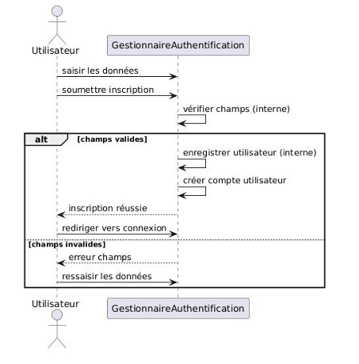
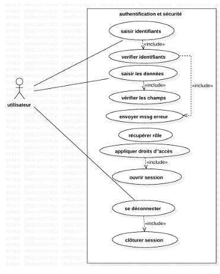
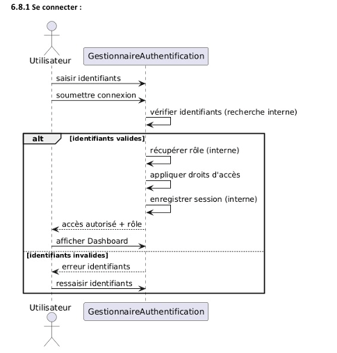

# 🏫 École Primaire Connectée — Système de Gestion Scolaire

Système web complet de gestion administrative et pédagogique d'une école 
primaire privée. Chaque acteur dispose d'un espace dédié avec des 
fonctionnalités adaptées à son rôle.

---

## 👤 Comptes de test

| Rôle | Email | Mot de passe |
|------|-------|--------------|
| Directeur | directeur@ecole.com | password |
| Enseignant | enseignant@ecole.com | password |
| Surveillant | surveillant@ecole.com | password |
| Parent | parent@ecole.com | password |

> Un parent peut aussi créer son propre compte via la page d'inscription.

---

## 🖥️ Interface par rôle

### 🔵 Directeur
- Vue globale : nombre d'élèves actifs, classes, enseignants
- Gestion des classes (créer, affecter enseignants, gérer élèves)
- Traitement final des dossiers d'inscription (accepter / rejeter)
- Consultation de la vue financière
- Messagerie interne

### 🟢 Surveillant Général
- Tableau de bord : inscriptions en attente, absences non archivées
- Vérification et traitement des dossiers d'inscription
- Gestion des absences (saisie, justification, archivage)
- Création et publication de l'emploi du temps
- Validation des paiements cash
- Messagerie interne

### 🟡 Parent
- Soumettre une demande d'inscription pour son enfant
- Suivi du statut du dossier en temps réel
- Consultation des bulletins, absences, emploi du temps
- Dossier financier et historique des paiements
- Messagerie avec l'administration
- Notifications automatiques (inscription, messages, absences)

### 🔴 Enseignant
- Saisie et modification des notes par classe et matière
- Consultation de l'emploi du temps
- Signalement des absences
- Messagerie interne

### ⚪ Élève
- Consultation de ses notes et bulletins
- Consultation de son emploi du temps
- Suivi de ses absences

---

## 🔐 Authentification





Le système vérifie les identifiants, récupère le rôle de l'utilisateur 
et applique les droits d'accès correspondants avant d'ouvrir la session. 
Chaque page est protégée par `session_check.php`.

---

## 📋 connexion



## 🛠️ Stack Technique

- **Backend** : PHP 8.2 (PDO)
- **Base de données** : MySQL / MariaDB
- **Frontend** : HTML, CSS, JavaScript
- **Serveur** : Apache (XAMPP)

---

## 🚀 Installation

**Prérequis** : XAMPP installé

```bash
# 1. Cloner le repo dans htdocs
git clone https://github.com/abdoumaski04-collab/primary-school-management-php
C:\xampp\htdocs\umllast

# 2. Configurer la base de données
cp config.example.php config.php

# 3. Importer la base de données
# Ouvrir phpMyAdmin → créer la base "ecolee_privee"
# Importer le fichier ecolee_privee.sql

# 4. Démarrer XAMPP (Apache + MySQL)

# 5. Accéder à l'application
http://localhost/umllast
```

---

## 🗄️ Structure du projet
umllast/
├── index.php                   → Page de connexion
├── inscription.php             → Inscription parent
├── config.example.php          → Template configuration BD
├── session_check.php           → Protection des pages
├── ecolee_privee.sql           → Base de données
├── dashboard_directeur.php
├── dashboard_surveillant.php
├── dashboard_parent.php
├── dashboard_enseignant.php
├── dashboard_eleve.php
├── inscriptions/               → Gestion dossiers
├── classes/                    → Gestion classes
├── eleves/                     → Gestion élèves
├── notes/                      → Notes et bulletins
├── bulletins/                  → Génération bulletins
├── absences/                   → Absences et justifications
├── edt/                        → Emploi du temps
├── paiements/                  → Frais de scolarité
├── messages/                   → Messagerie interne
└── notifications/              → Notifications

